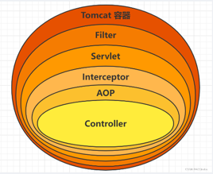
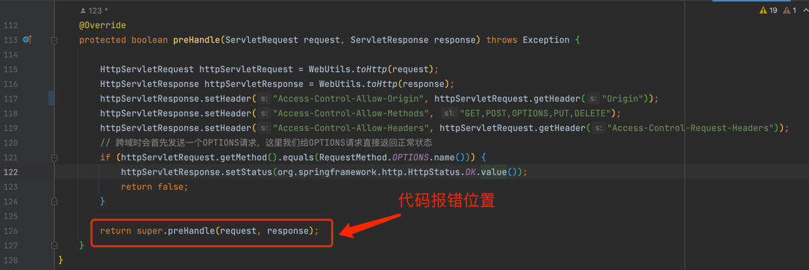
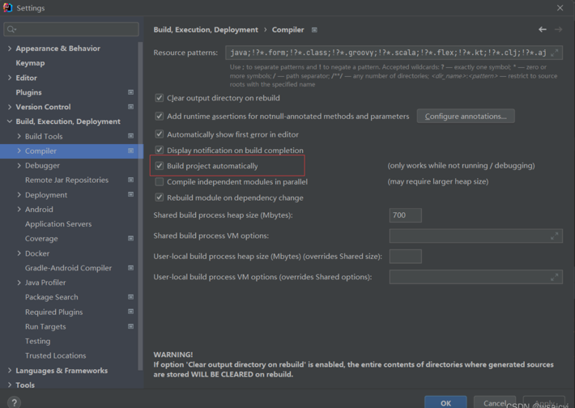
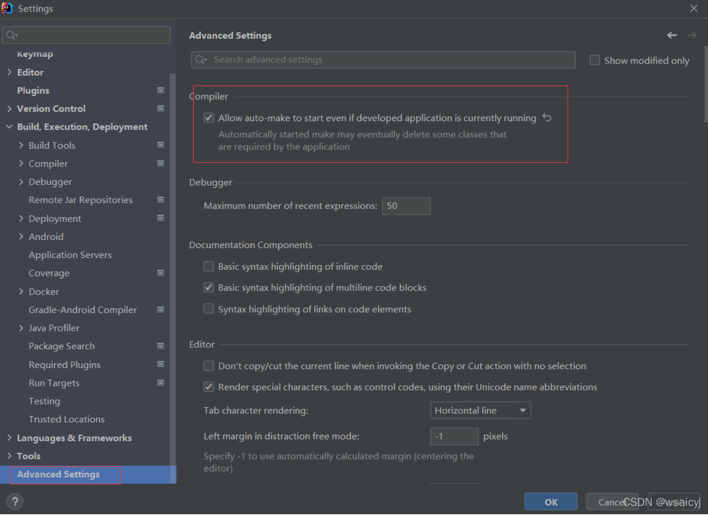

# 博客项目后端说明
## 技术栈
- SpringBoot
- mybatis plus
- shiro
- lombok
- redis
- hibernate validatior
- jwt
- Druid
- swagger2
- logback
## 开发工具与环境
开发工具与环境：
- idea
- mysql
- jdk 8
- maven3.3.9
## druid和swagger访问链接
### Druid
- http://localhost:8081/druid
### swagger2
- http://localhost:8081/swagger-ui.html
## 开发过程中问题记录
### SpringBoot 全局异常捕获不到Filter中的异常
#### 场景
> SpringBoot项目中，定义了全局异常捕获类，但是当在shiro的Filter校验Token失败后抛出异常时，无法捕获异常
#### 原因分析
> SpringBoot中，通过`@ControllerAdvice`+`@ExceptionHandler`实现的全局异常捕获类，**只捕获Controller层的异常**，众所周知，Filter是在Controller层之前。
> 
#### 解决方案
- 新增异常过滤器`ExceptionFilter`，将过滤器中的异常交给`Controller`中处理
  - 详见`src/main/java/com/oyj/vueblog/common/exception/ExceptionFilter.java`
- 新建过滤器配置类`FilterConfig`，实例化`ExceptionFilter`
  - 详见`com/oyj/vueblog/config/FilterConfig.java`
- 实现Controller接收过过滤器发来的异常
  - 详见`com/oyj/vueblog/controller/ErrorController.java`
### 引入Druid连接池后shiro一直报错`No SecurityManager accessible to the calling code, either bound to the org.apache.shiro.util`
#### 场景
> Druid配置完成后任何请求都会引起该报错
#### 原因分析
- 具体错误信息如下
```
org.apache.shiro.UnavailableSecurityManagerException: No SecurityManager accessible to the calling code, either bound to the org.apache.shiro.util.ThreadContext or as a vm static singleton.  This is an invalid application configuration.
	at org.apache.shiro.SecurityUtils.getSecurityManager(SecurityUtils.java:123)
	at org.apache.shiro.subject.Subject$Builder.<init>(Subject.java:627)
	at org.apache.shiro.SecurityUtils.getSubject(SecurityUtils.java:56)
	at org.apache.shiro.web.filter.AccessControlFilter.getSubject(AccessControlFilter.java:97)
	at org.apache.shiro.web.filter.authc.AuthenticationFilter.isAccessAllowed(AuthenticationFilter.java:80)
	at org.apache.shiro.web.filter.authc.AuthenticatingFilter.isAccessAllowed(AuthenticatingFilter.java:123)
	at org.apache.shiro.web.filter.AccessControlFilter.onPreHandle(AccessControlFilter.java:162)
	at org.apache.shiro.web.filter.PathMatchingFilter.isFilterChainContinued(PathMatchingFilter.java:203)
	at org.apache.shiro.web.filter.PathMatchingFilter.preHandle(PathMatchingFilter.java:178)
	at com.oyj.vueblog.shiro.JwtFilter.preHandle(JwtFilter.java:126)
	at org.apache.shiro.web.servlet.AdviceFilter.doFilterInternal(AdviceFilter.java:131)
	at org.apache.shiro.web.servlet.OncePerRequestFilter.doFilter(OncePerRequestFilter.java:125)
	at org.apache.catalina.core.ApplicationFilterChain.internalDoFilter(ApplicationFilterChain.java:193)
	at org.apache.catalina.core.ApplicationFilterChain.doFilter(ApplicationFilterChain.java:166)
	at com.alibaba.druid.support.http.WebStatFilter.doFilter(WebStatFilter.java:124)
```
> 通俗的对错误原因描述为：
你所请求的URL是不在Shiro所管辖范围的，而你又在你请求的这个URL后试图通过Shiro来获取Session，所以对Shiro来说“你不让我负责的事，为什么要跟我要结果”。
- 根据错误日志，找到代码中出现异常的位置是在shiro自定义过滤器`JwtFilter`中的前置拦截方法`preHandle`里
  - 
- 从报错位置开始debug，发现当前线程没有创建`SecurityManager`，所以问题是：**请求进来了，但是SecurityManager没初始化**
> 所以该错误的根因是Druid请求的URL不在shiro的管辖范围，但是会被shiro前置拦截器给拦截，Druid的请求进来时，shiro的`securityManager` 和 `subject`还未初始化，导致报错
#### 解决方法
- 重写`shiroConfig`配置，在`shiroFilterChainDefinition`中过滤掉Druid的请求，顺便把登录请求和swagger请求都直接放行，改写后，配置了anon的接口不会再通过jwtFilter
> 注意：只配置过滤器链不会生效，需要在`shiroConfig`新增一个配置JwtFilter过滤器,并设置为未注册状态，详见`com/oyj/vueblog/config/ShiroConfig.java`
### idea中使用devtools热部署配置不生效
#### 解决方案
- 1.勾选出setting里面的build project automatically
  - 
- 2.勾选出setting里面的Advanced Setting中的allow....
  - 
- 3.点击Apply后重启项目即可生效
## 常用命令
### Redis
...